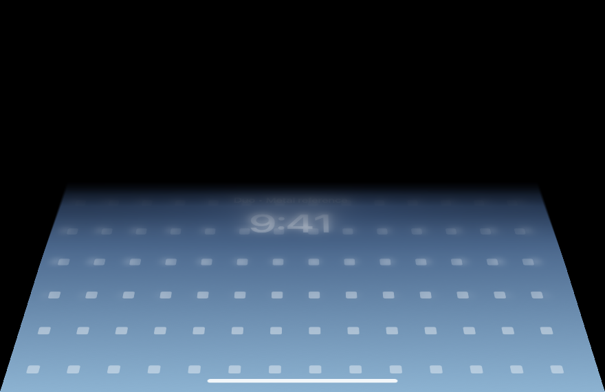

# DuoLidAnimation

Рабочий стол наклоняется и размывается, когда вы закрываете крышку MacBook. Угол берётся с настоящего датчика шарнира; открытие крышки разворачивает эффект обратно.

Приложение живёт в строке меню. Кадры обрабатываются локально через ScreenCaptureKit и Metal, без записи на диск и передачи по сети.



*Тестовое изображение, отрисованное шейдером приложения. В обычном режиме вместо него — ваш рабочий стол.*

## Установка

1. Скачайте `DuoLidAnimation-1.1.zip` из **Releases**.
2. Распакуйте архив и перенесите `DuoLidAnimation.app` в «Программы».
3. Откройте приложение и разрешите запись экрана в настройках конфиденциальности macOS. После выдачи разрешения перезапустите приложение.
4. В меню `◩` выберите «Начинать складывание с текущего угла», удерживая крышку в обычном рабочем положении.

Сборка подписана локально, без Developer ID и notarization. Если macOS блокирует запуск, после первой попытки открытия нажмите «Всё равно открыть» в **Системные настройки → Конфиденциальность и безопасность**. [Инструкция Apple](https://support.apple.com/guide/mac-help/mh40616/mac).

**Нужен MacBook с Apple Silicon, доступным датчиком угла крышки и macOS 14 или новее.** Проверено на MacBook Air M4 с macOS 26.4. Наличие датчика на других моделях нужно проверять; готовая сборка не работает на Intel.

## Управление

Меню `◩` показывает реальный угол крышки. Через него можно приостановить эффект, изменить параметры, повторить подключение или завершить приложение. Overlay пропускает события мыши и не забирает фокус клавиатуры.

«Открыть параметры анимации» открывает файл:

```text
~/Library/Application Support/DuoLidAnimation/AnimationConfig.json
```

После редактирования выберите «Применить параметры». Настройки создаются из [Config/AnimationConfig.json](Config/AnimationConfig.json) при первом запуске.

| Параметр | По умолчанию | Что меняет |
|---|---:|---|
| `startAngle` | 100° | Угол начала эффекта |
| `endAngle` | 8° | Угол максимального складывания |
| `perspectiveStrength` | 0.38 | Силу перспективы, 0–2 |
| `blurStrength` | 36 | Gaussian blur относительно ширины 880 px, 0–80 |
| `darkness` | 0.9 | Верхние и угловые тени, 0–1 |
| `verticalCompression` | 1 | Вертикальное сжатие, 0–1 |
| `easing` | `smoothstep` | Также доступны `cubic` и `linear` |
| `animationSensitivity` | 1 | Чувствительность, 0.2–3 |

`startAngle` должен быть больше `endAngle` минимум на 1°. Калибровка из меню меняет только `startAngle`.

## Сборка из исходников

Нужен Swift 6 из Xcode или Command Line Tools. Сторонних зависимостей нет.

```sh
./Utilities/build.sh
open build/DuoLidAnimation.app
```

Скрипт создаёт оптимизированное `.app` для архитектуры текущего Mac и подписывает его ad-hoc. Metal-шейдер компилируется один раз при запуске через `MTLDevice.makeLibrary(source:)`.

Для Xcode есть готовый проект и общая схема:

```sh
xcodebuild -project DuoLidAnimation.xcodeproj \
  -scheme DuoLidAnimation -configuration Release \
  -derivedDataPath build/Xcode build
```

При конфликте двух `SwiftBridging` module maps в CLT скрипт применяет локальный VFS overlay и использует SDK 15.5, если он установлен. Системные файлы не меняются. Подробности — в [docs/development.md](docs/development.md).

## Как это устроено

- **LidSensor** открывает Apple HID-устройство `0x05AC`, usage page `0x20`, usage `0x8A`. Report 1 содержит угол в градусах. Опрос идёт в отдельной очереди каждые 8 мс. Подставных значений при ошибке нет.
- **Capture** захватывает встроенный экран в Retina-разрешении. Из фильтра исключено всё приложение, поэтому overlay не попадает в следующий кадр.
- **Renderer / Shaders** отображают кадр как перспективную плоскость с неподвижным нижним краем. Три уровня Gaussian blur усиливаются кверху; край постепенно исчезает в тени. Pixel buffer передаётся в Metal через IOSurface без CPU-копирования.
- **Overlay / App** управляют окном, разрешениями и сном. При пробуждении сохраняется предыдущая поза до получения свежего угла и кадра.

## Ограничения

- При полном закрытии крышки Mac засыпает. Приложение не отключает сон.
- После пробуждения macOS управляет первым показом дисплея и экраном блокировки. Исправление перехода проверено программным тестом; поведение полного физического sleep/wake цикла ещё нужно проверять на разных Mac.
- Захват работает и при открытой крышке, чтобы эффект начинался без ожидания. Это расходует энергию; пауза останавливает захват и датчик.
- Курсор остаётся системным. Координаты кликов не пересчитываются по деформированной картинке.
- Внешние мониторы не деформируются. HDR передаётся в SDR, защищённое видео может не захватываться.
- Короткий тест на M4 дал около 60 кадров/с при 3420×2214. Это не гарантия для других устройств и нагрузки.

После пересборки ad-hoc подпись меняется. Если разрешение записи включено, но macOS продолжает отказывать, завершите приложение и сбросьте только его старую запись:

```sh
tccutil reset ScreenCapture local.duolid.animation
```

Затем откройте приложение и выдайте разрешение заново.

## Референсы

Визуальный ориентир — [Bendy](https://trybendy.app/) и эффект складывания iPhone Duo. Это отдельная реализация, не связанная с их авторами; точное совпадение с закрытым приложением не заявляется.

Для исследования HID-интерфейса использовались локальные IOKit headers и IORegistry, а также [mac-angle](https://github.com/ufoym/mac-angle) и [LidAngleSensor](https://github.com/samhenrigold/LidAngleSensor).
